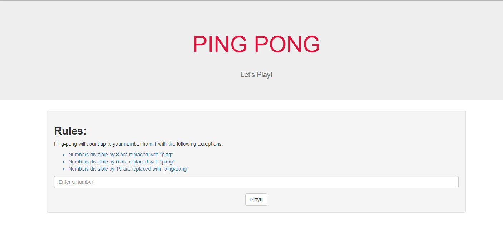
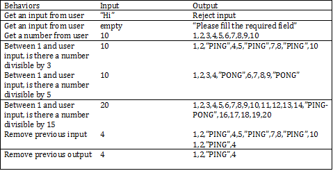

# PING-PONG

## Landing SITE

## Website
Ping-pong game will count up to your number from 1 with the following exceptions:
* Numbers divisible by 3 are replaced with "ping"
* Numbers divisible by 5 are replaced with "pong"
* Numbers divisible by 15 are replaced with "ping-pong"

## Behavoir Driven Development Layout

## Usage
* Fork the repository
* Create a new branch (--fix) in git on your computer
* Make changes to the work on the new branch
* Add the changes
* Commit changes
* Push the changes
* Create a pull request

## Setup/Installation Requirements
* Atom editor
* git bash
* Google chrome

## Technologies Used
* HTML
* CSS
* JQuery

## Support and contact details
For more information: Send a message on slack \@ Esther

### Demo
https://emukungu.github.io/ping-pong/

### License
MIT License

Copyright (c) 2018 **Esther**
